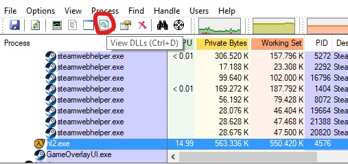
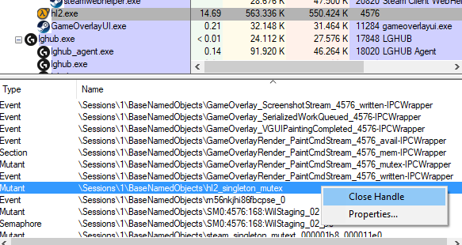
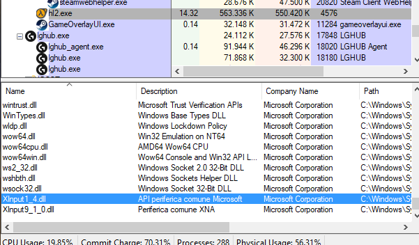

# Nucleus-Coop scripting
This, is my approach when I want to script a game.
Hope that could be useful for who want to create scripts for Nucleus-Coop.

## Reddit F.A.Q Post

I invite you to read the [FAQ](https://www.reddit.com/r/nucleuscoop/comments/fjdqid/list_of_new_supported_games_and_faq/ ) post before continuing.
It will help you understand better how Nucleus-Coop works and
fix possible problems.

## Where to start?

Before doing something, I suggest checking the game's [PcGamingWiki](https://www.pcgamingwiki.com/wiki/Home) page. Here you will find most of the game's known problems, what input supports and what type of multiplayer connections supports.


### Input
About gamepads support:
- Nucleus-Coop has different methods to restrict XInput gamepads and is easier to make them work (also, most modern games support them).
- Nucleus-Coop has only one method to restrict DInput gamepads. Not always works and when it does is mostly for older games (devreorder).


### Connectivity

The game should support LAN multiplayer as a native option, if it doesn't support LAN:
- If it is available on the Steam Store, you can still use [Goldberg's Emulator](https://gitlab.com/Mr_Goldberg/goldberg_emulator) (Nucleus-Coop has a built-in option). Be sure it uses SteamWorks and not external servers for multiplayer
- If it is available only on the Epic Games Store, you can try use [Nemirtinga's Epic](https://gitlab.com/Nemirtingas/nemirtingas_epic_emu) Emulator (Nucleus-Coop has a built-in option). Be sure it uses Epic Games API and not external servers for multiplayer.
- Search for a possible LAN/Multiplayer mod on Google.
## Testing
Nucleus-Coop as all the features for making copies of your game and set external tools. I suggest you use a public script, remove the not necessary lines, and doing the tests with that.
(usually, the ones of games that use the same game-engine share a lot of characteristics. Example: You are scripting an Unreal Engine 4 game? Use as a base-script one that uses Unreal Engine 4).
If you still want to manually test it, you should make a copy of your original game and use that instead.

### Start multiple instances
First thing, you must find a way to make the game run multiple times.
If it doesn't run twice, these are the methods that I know (*For some games, you will need to combine these methods)
#### Closing game mutexes:

<br />

Most of the games, need a specific (or more) mutex/event/semaphore to be closed.
Usually, the right one/ones have the game-name or engine-name in the name. For example, most source games use ***"hl2"_singleton_mutex***.
To check which ones the game use, we will use [Process Explorer](https://docs.microsoft.com/en-us/sysinternals/downloads/process-explorer).


<br />

Open Process Explorer (with ***admin rights***), start the game, click the game process on the list, and press ***View Handles*** (Ctrl+H). You will see the full list of mutex/event/semaphore, etc.
If you think to have found the right one, right-click on it and choose ***"Close Handle"***. After that, try to run a second instance of the game and see if it opens. (some games require multiple mutexes to be closed).
Be careful that launchers check if the game is already running. For example, Goldberg, make it unseen from Steam.

#### Rename the game exe

Change the game exe name for each instance (in Nucleus-Coop = Game.ChangeExe = true;)


#### Change the title of the game window


You can use [winexp](https://www.nirsoft.net/utils/winexp.html) with admin rights for testing. (in Nucleus-Coop = Game.IdInWindowTitle = true;) 

#### Start the game as a different windows user

For testing, you need a second windows user and press ***shift + right-click*** on the exe and choose ***"Rus as another user"***. (In Nucleus-Coop you can use Game.LaunchAsDifferentUsers = true; and if needed Game.ThirdPartyLaunch = true;)

:::note If you use a script for testing, here two lines that could help you:

This line will keep the game files inside the Nucleus-Coop\content folder. In this way, you can do the process manually and verify if the problems you are getting are Nucleus-Coop related.  
```Game.KeepSymLinkOnExit = true; 			//Enable or disable symlink files from being deleted when Nucleus is closed | default: false```

If by doing manually the second instance starts, while through Nucleus-Coop don't, try adding this line. (You can also disable all the not necessary lines and enable one at the time between each test to identify which one causes problems). 
```Game.HookInit = true;					//Enable or disable hooks of functions some games may try and use to prevent multiple instances from running | default: false```
:::

## Connectivity

After you made multiple instances start, is the time to test the connectivity.
While for games with native LAN you will just need to check if the instances see each other through the multiplayer menu, for games that must use Goldberg/Nemirtinga's emulators you will need to set them for each copy of the game (each instance must have a different SteamID inside user_steam_id.txt and nickname inside account_name.txt).
I usually directly create a script and make Nucleus-Coop set the instances for me. Recently, a software called [GoldbergGUI](https://www.reddit.com/r/GoldbergEmu/comments/kxsaki/goldberggui_frontend_for_goldberg_emulator/?utm_source=share&utm_medium=web2x&context=3), that helps you set Goldberg for you, was just released if you still want to try manually.


## Scripting Tips

If all work is time to script it. Now, You will start testing input restriction and focus methods!
Start by checking how the public scripts work and use as an example one that uses the same game-engine of the game you are trying to script.

### Some tips and essential lines

You can find most of the lines in the Mod-ReadMe.txt (inside Nucleus-Coop root folder) and in the Master_SCript.js (documentation link inside Reddit FAQ post).
Also, all my public scripts (Bizzo) have descriptions inside that could help you.
Next, you will find the most used ones.

### Game Info

#### Essential lines

Line  | Description
----- | -----------
Game.ExecutableName = "game.exe";  | 	What executable the game use. This will be used by Nucleus for "exe script selection", for run the game and as the process to follow for positioning and resizing.
Game.GUID = "GameName";  | The name of the folder that will be created inside the Nucleus\content folder (Don't use spaces). In this folder, Nucleus will store the game files for each instance of the game.
Game.GameName = "Game Name on Nucleu UI"; | Title of the game that will be shown on Nucleus.
Game.MaxPlayersOneMonitor = 4; |	This is just an info. It will not limit the players' numbers.
Game.MaxPlayers = 16; | 	This is just an info. Usually, we write the max players number the game support. 

#### Other important ones

Line | Description
---- | -----------
Game.BinariesFolder = "Bin"; | In which folder the game exe is located? Relative path to where Nucleus should start the game's working folder to.
Game.SteamID = "1234"; | Here the SteamID of the game. You can find it on https://steamdb.info/ . Add it only if the game is available on Steam.
Game.LauncherTitle = ""; | The name of the launcher's window title. Some games need to go through a launcher to open. This is needed or else the application will lose the game's window.
Game.LauncherExe = "gamelauncher.exe";  | If the game needs to go through a launcher before opening. Nucleus will use this exe to start the game and it will follow Game.ExecutableName process for resizing and positioning. You can also write it like this: Game.LauncherExe = "gamelauncher.exe|NucleusDefined"; for let the User select the launcher exe the very first time (useful if is not located in the game folder).
Game.LauncherExeIgnoreFileCheck = true;	 | Do not check if Launcher Exe exists in game folder | you will need to provide a relative filepath from game root folder

#### Nucleus-Coop Environment

This function will provide a different game's Document path for each player.

When a player is initialized, Nucleus-Coop will edit the Windows registry lines to make the game use a different path for search/create Documents files.
You can find the registry lines inside this path:
**HKEY_CURRENT_USER\SOFTWARE\Microsoft\Windows\CurrentVersion\Explorer\User Shell Folders**

Then, you will be able to access in the script context part ( [Game.Play= function() {](#gameplay--function-) ) by using:
- Context.EnvironmentPlayer (specific player Environment path) or  Context.EnvironmentRoot (Nucleus-Coop Environment Folder root) when using the UserProfile lines.
- Context.DocumentsPlayer (specific player Documents path) or Context.DocumentsRoot (Nucleus-Coop Documents Folder root) when using the Documents lines.

Line | Description
---- | -----------
Game.UseNucleusEnvironment = true; | Use custom environment variables for games that use them, replaces some common paths (e.g. AppData) with C:\Users\\<your username\>\NucleusCoop
Game.UserProfileConfigPath = "AppData\\Local\\Game\\Config"; | Relative path from user profile (e.g. C:\Users\ZeroFox) to game's config path <br /> Used to provide some extra functionality (open/delete/copy over to Nucleus Environment). In context = Context.UserProfileConfigPath 
Game.UserProfileSavePath = "AppData\\Local\\Game\\Saves"; | Relative path from user profile (e.g. C:\Users\ZeroFox) to game's save path <br /> Used to provide some extra functionality (open/delete/copy over to Nucleus Environment). In context = Context.UserProfileSavePath 
Game.DocumentsConfigPath = "Path\\Here"; | Relative path from user document folder (e.g. C:\Users\ZeroFox\Documents) to game's config path <br /> Used to provide some extra functionality (open/delete/copy over to Nucleus Environment). Use this when the game uses Documents to store game files. In context = Context.DocumentsConfigPath
Game.DocumentsSavePath = "Path\\Here"; | Relative path from user document folder (e.g. C:\Users\ZeroFox\Documents) to game's save path. <br /> Used to provide some extra functionality (open/delete/copy over to Nucleus Environment). Use this when the game uses Documents to store game files. In context = Context.DocumentsSavePath


### Handlers

#### This is needed

Line | Description
---- | ----------
Game.HandlerInterval = 100; | The interval in milliseconds the Handler should be updated at. Set it to 0 to disable updating (will lose all functionality that depends on ticks).

#### Higher time could help low spec PCs

Line | Description
---- | ----------
Game.PauseBetweenStarts = 20; | Pause between game intances starts in milliseconds.

### Focus

All player's game instances must think they are the currently active window to receive input and play.

:::note
These must be always present. ForceFocus is not always needed on true. Try to see if there are any differences if you set it on false.
:::

Line | Description
---- | ----------
Game.Hook.ForceFocus = true;    |If our custom x360ce xinput DLL should hook into the game's window and fake Window's events so we never leave focus.
Game.Hook.ForceFocusWindowName = "Game window title"; | If force focus is enabled, this is the window we are attaching ourselves to and the window we are going to keep on top. Needs the exact name of the window. If force focus is disabled you still need to set the game window name for resizing and positioning.

If the game window title changes at some point or you want to use only a portion of the title text.

Line | Description
---- | ----------
Game.HasDynamicWindowTitle = true;  | This will use only the text specified in ForceFocusWindowName. Work-around for ForceFocusWindowName having to match 1:1 with game window title for resizing, positioning, and focus: default: false

If you hear audio only from one instance try adding this line.

Line | Description
---- | ----------
Game.HookFocus = true; | Enable or disable hooks to trick the game into thinking it has focus <br /> default: false

If only one instance has focus and the other ones has no input try to add this one.

Line | Description
---- | ----------
Game.FakeFocus = true; | Enable or disable the sending of focus messages to each game window at a regular interval <br /> default: false

or use this one INSTEAD (this will block keyboard/mouse input).

Line | Description
---- | ----------
Game.PreventWindowDeactivation = true; | Blocks the processing of the windows message that gets sent when the window loses focus

If only one instance has high FPS try to add this one (*for gamepads).

Line | Description
---- | ----------
Game.SetForegroundWindowElsewhere = true; | Set the foreground window to be something other than game windows

This line could help if only the first instance starts.

Line | Description
---- | ----------
Game.HookInit = true; | Enable or disable hooks of functions some games may try and use to prevent multiple instances from running <br /> default: false

### Input

Single keyboard (you can set it on false if you use multiple keyboards/mice lines):

Line | Description
---- | ----------
Game.SupportsKeyboard = true; | If enabled, will allow the keyboard to be used as a device input in Nucleus. Before enabling it by default, be sure that the keyboard/mouse works without problems.
Game.KeyboardPlayerFirst = false; | Keyboard player will be the first to be initialized

#### Gamepads

Line | Description
---- | ----------
Game.Hook.DInputEnabled = false; | If enabled, will allow DInput devices to be used as a device input in Nucleus. This doesn't mean that it will work with the game if not supported.
Game.Hook.DInputForceDisable = true; | If we should completely remove support for DirectInput input from the game
Game.Hook.XInputEnabled = true; | If enabled, will allow XInput devices to be used as a device input in Nucleus. This doesn't mean that it will work with the game if not supported.
Game.Hook.XInputReroute = false; | If enabled, will allow XInput devices to act like DInput devices. This allows using more than 4 controllers. You can use only ONE XboxOne controller and you can't use at the same time the keyboard. You must click/alt+tab on the corresponding instance to make it work. In alternative, you can try to fix the problem by doing this [workaround](http://www.snes9x.com/phpbb3/viewtopic.php?t=27510) or try Xoutput.
Game.UseDInputBlocker = true; | Setup wizark952's dinput blocker (block dinput for the game). This line will help users that use an XInput emulator. Use it when the script should restrict XInput gamepads and DInput will not be used in any way.




You can find out which dlls the game is using with Process Explorer. 
Start the game, open Process Explorer, click on the game process and click on View DLLs (Ctrl+D).
Search on the list, and you will find which Xinput DLLs the game is using. A game that supports controllers but not Xinput ones (old games) use dinput8.dll or dinput.dll.

### XInput Restriction

This is used to restrict each controller to a specific instance. Disable other alternatives if you are using this one. CustomDllEnabled is enabled by default so, if you will not use it, you must add this line in false.

***If the game should be run using our custom version of x360ce for gamepad control. Enabled by default as the majority of our games need it.**

Line | Description
---- | ----------
Game.Hook.CustomDllEnabled = false; | Game.Hook.XInputNames = [ "xinput1_3.dll"]; //This line specify which DLLS CustomDll will use. DInput dlls are not supported.

This is used to restrict each controller to a specific instance. Disable other alternatives if you are using this one. For XInputPlusDll, remove or comment the line by using // for disable it.

This set up XInputPlus and specify which Xinput DLL it will use (If multiple dlls required, use comma-separated strings).
XinputPlus support max 4 controllers.

Line | Description
---- | ----------
Game.XInputPlusDll = ["xinput1_3.dll"]; | You can specify different xinput dlls. Add dinput dlls for use XinputPlus DInput mode and let XInput gamepads work in game that doesn't have XInput support. Example ["xinput1_3.dll", "dinput.dll", "dinput8.dll"];
Game.XInputPlusOldDll = true; | It seems that new xinputplus DINPUT dlls make games crash. When using Game.XInputPlusDll, you can specify to use the previous version instead of the latest (needed for some games)

This is used to restrict each controller to a specific instance. Disable other alternatives if you are using this one.

Line | Description
---- | ----------
Game.InjectHookXinput = true; | This method is the same used by Universal Split Screen (Hook Xinput for gamepads). It will make the instance redirect the controllers' input to a specific controller index. This restriction method doesn't create any files.
Game.InjectDinputToXinputTranslation = true; | If you want to translate XInput to Dinput when using this restriction method + Game.Hook.XInputReroute = true;

This is used to restrict each controller to a specific instance. Disable other alternatives if you are using this one. This will use X360ce.

Line | Description
---- | ----------
Game.UseX360ce = true; | Before launching any games, NucleusCoop will open x360ce and let the user set up their controllers before continuing <br /> close x360ce to continue <br /> Don't use with custom dlls

### DInput Restriction
This is used to restrict each controller to a specific instance. Disable other alternatives if you are using this one.

Line | Description
---- | ----------
Game.UseDevReorder = true; | Set up Devreorder. This is used to restrict only DInput controllers. You can use Xinput ones only if you enable XInputReroute. You can use only ONE XboxOne controller and you can't use at the same time the keyboard. You must click/alt+tab on the corresponding instance to make it work. In alternative, you can try to fix the problem by doing [this](http://www.snes9x.com/phpbb3/viewtopic.php?t=27510) or try Xoutput.*/


### Multiple Keyboards/Mice lines

***thanks to Ilyaki for the multiple keyboards and mice support and guide***

Line | Description
---- | ----------
Game.SupportsMultipleKeyboardsAndMice = true; | If enabled, it will allow multiple Keyboards and Mice to be used as a device input in Nucleus. Before enabling it by default, be sure that all works without problems.
Game.HookSetCursorPos = true; | This will hook the SetCursorPos Windows function which the game may use to set the mouse position. <br /> This is useful to have on to prevent the game from moving the 'real' Windows mouse cursor around the screen.
Game.HookGetCursorPos = true; | This will hook the GetCursorPos Windows function which the game may use to get the mouse position.
Game.HookGetKeyState = true; | These options hook Windows functions that can be used by the game to detect if keys are down.
Game.HookGetAsyncKeyState = true; | HookGetAsyncKeyState is usually the only one that's needed, but leave the others enabled if there are no problems.
Game.HookGetKeyboardState = true; | Some games may conflict with these hooks, so try toggling some of them if keyboard input isn't working properly.
Game.HookFilterRawInput = true; | This filters raw input messages inside the application. This makes sure each instance only receives input for its designated input device.
Game.HookFilterMouseMessages = true; | This hook filters many mouse messages to position the mouse cursor and other necessary changes from within the game itself. <br /> This should almost always be enabled unless it causes some conflict.
Game.HookUseLegacyInput = true; | This is the main switch for legacy input.
Game.HookDontUpdateLegacyInMouseMsg = true; | ****Nucleus Coop will hook mouse movement messages and the GetCursorPos function to work around legacy input. Some games only need the GetCursorPos hook and conflict when mouse movement messages are edited. If this is the case, enable this option***
Game.HookMouseVisibility = true; | Used for games that toggle the mouse visibility, e.g. hidden in first person movement and visible in menus. <br /> This shows/hides the fake mouse cursor when the game tries to show/hide the 'real' mouse cursor. <br /> ***!!!!Most of the time this one is the cause of crashes.!!!!***
Game.SendNormalMouseInput = true; | This will send the game mouse input via Windows messages.
Game.SendNormalKeyboardInput = true; | This sends keyboard input via Windows messages. This is usually all that's needed to get keyboard input working.
Game.SendScrollWheel = true; | Use this to send scroll wheel events to the game. <br /> Some games don't need this, if for example they receive scroll wheel data from raw input.
Game.ForwardRawMouseInput = true; | In some cases, you may need to forward raw mouse input. This is almost never needed as re-register raw input has the same effect with a much more efficient method. Forwarding input forwards raw input from Nucleus Coop to the game. This has a high CPU usage and many input events will not pass, resulting in choppy movement.
Game.ForwardRawKeyboardInput = true; | The same as ForwardRawMouseInput, but for keyboards. Again, this should almost never be used instead of re-register raw input.
Game.HookReRegisterRawInput = true; <br /> Game.HookReRegisterRawInputKeyboard = true; <br /> Game.HookReRegisterRawInputMouse = true; | This will re-register the game for Windows raw input with the option to receive input while not in the foreground. <br /> This is important as most games will register to receive raw input only when in the foreground.
Game.DrawFakeMouseCursor = true; | This enables the fake mouse cursor to be drawn over the game by Nucleus Coop. <br /> If the game uses a custom cursor, you will probably not need this option. (This will be obvious if you see the games custom cursor and a fake cursor drawn over it). <br /> Be aware this is a 'fake' mouse cursor in the sense that Nucleus Coop will fake mouse input to the game via the other options and then the fake mouse cursor is drawn where the game should be responding to mouse input. <br /> The fake cursor is drawn by creating a large transparent window over the game. This may prevent the game from receiving mouse input from the 'real' Windows cursor. It is sometimes useful to disable this while testing.
Game.DrawFakeMouseCursorForControllers = true; <br /> Game.UpdateFakeMouseWithInternalInput = true; | If you are using controllers and need a fake mouse cursor, try these options
Game.LockInputAtStart = true; |Once you have finished setting up the input options, enable this to automatically lock input (equivalent to pressing End) once all of the instances have been set up. <br /> This is usually convenient to leave disabled whilst testing.
Game.LockInputToggleKey = 0x23; | If you need to change the key to toggle input lock, e.g. if the game uses the End key, edit it with this. <br /> : You can find a list of keys and their numbers [here](https://docs.microsoft.com/en-us/windows/win32/inputdev/virtual-key-codes)


## Game.Play = function() { 

Inside "Game.Play = function() {" you can write operations that Nucleus will do in the context of the game starting. The lines inside this section are unique on each script.
I invite you to check the documentation inside the FAQ Reddit post or check other scripts to see examples. As I said, mine (Bizzo) as descriptions inside that could help you.

### Here some examples

#### Create a Directory

Code | Steps
:--: | :---:
var filePath = (Context.filePath = Context.GetFolder(Nucleus.Folder.InstancedGameFolder) + "\\scripts"); <br /> System.IO.Directory.CreateDirectory(filePath); | This is an example taken by the Need For Speed: Most Wanted (2005) script by Bizzo. <br /> The variable filePath  will contain the path and the name of the folder. <br /> In this case, it will be inside the root of the current player instance game folder (Context.GetFolder(Nucleus.Folder.InstancedGameFolder)), then the remaining path and in the end the name of the folder you want to create ("\\scripts"). <br /> In this example (because the game is symlinked) it will be: "Path to NucleusCoop folder\content\NeedForSpeedMostWanted2005 (name specified in Game.GUID line)\InstanceN# (If you don't specify it, it will be created inside all current players folders each time the corresponding one is initialized)\scripts".

#### Copy a Specific File

Code | Steps
:--: | :---:
var savePath = Context.NucleusFolder + "\\utils\\FlawlessWidescreen\\x64\\settings.xml"; <br /> var savePkgOrigin = System.IO.Path.Combine(Game.Folder, "FlawlessWidescreen\\settings.xml"); <br /> System.IO.File.Copy(savePkgOrigin, savePath, true); | This is an example taken by the The Dark Pictures Anthology: Man of Medan script by Bizzo. <br /> The variable savePath  contains the path where the file will be copied and the final name of the file (use a different one to rename it). <br /> The variable savePkgOrigin  contains the path of the source file. <br /> In this case, the source path of the file that the script will copy is inside the corresponding game scripts folder (Game.Folder) and  the destination will be inside the Nucleus-Coop utils folder. <br /> In this example it will be: Source file = "Path to NucleusCoop folder\scripts\The Dark Pictures Anthology Man of Medan (Game.Folder.  This f older must be named as the .js file)\FlawlessWidescreen\settings.xml". Destination path = "Path to NucleusCoop root folder (Context.NucleusFolder)\utils\FlawlessWidescreen\x64\settings.xml". 

#### Edit a file that contains text

Code | Steps
:--: | :---:
var txtPath = Context.GetFolder(Nucleus.Folder.InstancedGameFolder) + "\\data\\config\\current\\current_control.map"; var dict = ["24<br />JOYSTICK ENABLED=TRUE", "70<br />KEYBOARD ENABLED=FALSE" ]; Context.ReplaceLinesInTextFile(txtPath, dict);  | This is an example taken by the Star Wars: Episode I - Racer script by Bizzo. <br /> The variable txtPath  contains the path of the file that the script will edit. <br /> The variable dict  contains the specific number of the line you want to edit and the text that will be written. <br /> In this example (because the game is symlinked): <br /> The  file we want to edit is = "Path to NucleusCoop folder\content\SWEpIRacer (name specified in Game.GUID line)\InstanceN# (If you don't specify it, it will be edited for all current players each time the corresponding one is initialized)\data\config\current\current_control.map". <br /> Line 24  will be  JOYSTICK ENABLED=TRUE . <br /> Line 70  will be  KEYBOARD ENABLED=FALSE .

If you don't know the exact number of the text line you want to edit you can make Nucleus-Coop search it for you.
By using the previous example, before **var dict**  you can do something like this:

**var joystick = Context.FindLineNumberInTextFile(txtPath, "JOYSTICK ENABLED", Nucleus.SearchType.Contains);**  

In this way, Nucleus-Coop will search for a line that contains the text **"JOYSTICK ENABLED"**  and store the line number in the variable joystick.
Then you can use it like this:

**var dict = [
joystick + "|JOYSTICK ENABLED=TRUE", 
];
Context.ReplaceLinesInTextFile(txtPath, dict);**

#### Edit a .ini type file

Code | Steps
:--: | :---:
var savePath = Context.GetFolder(Nucleus.Folder.InstancedGameFolder) + "\\XInputPlus.ini"; <br /> Context.ModifySaveFile(savePath, savePath, Nucleus.SaveType.INI, [ new Nucleus.IniSaveInfo("ControllerNumber", "Controller1", Context.PlayerID + 1), <br /> new Nucleus.IniSaveInfo("ControllerNumber", "Controller2", ""),  <br /> new Nucleus.IniSaveInfo("ControllerNumber", "Controller3", ""),  <br /> new Nucleus.IniSaveInfo("ControllerNumber", "Controller4", "")]); | This is an example taken by the Star Wars: Episode I - Racer script by Bizzo. <br /> The variable save Path  contains the path of the file that the script will edit. <br /> In this example (because the game is symlinked): <br /> The  file we want to edit is = "Path to NucleusCoop folder\content\SWEpIRacer (name specified in Game.GUID line)\InstanceN# (If you don't specify it, it will be edited for all current players each time the corresponding one is initialized)\XInputPlus.ini". <br /> Inside the .ini file section [ControllerNumber],  the variable Controller1  will be set as the Current Player ID + 1. While the other ones will be empty. <br /> [ControllerNumber] <br /> Controller1=1 <br /> Controller2= <br /> Controller3= <br /> Controller4=

#### Add Launch Options to the game exe

Code | Steps
:--: | :---:
var Args = (Context.Args = " -windowed -noborder -AlwaysFocus -insecure -novid +sv_lan 1 +sv_pausable 1 +fps_max " + fps); <br /> var Args = (Context.Args = " -windowed -noborder -AlwaysFocus -insecure -novid +sv_lan 1 +sv_pausable 1 +fps_max " + fps); <br /> Context.StartArguments = Args; Context.StartArguments = Args; | This is an example taken by the Day of Infamy script by Bizzo.<br /> The variable Args contains the launch options. 

#### Create a file with text lines inside

Code | Steps
:--: | :---:
var autoExec = Context.GetFolder(Nucleus.Folder.InstancedGameFolder) + "\\doi\\cfg\\autoexec.cfg";   var lines = [ "engine_no_focus_sleep 0",        'm_rawinput "1"',        "bind F8 pause",        'joystick_force_disabled_set "1"',        "exec undo360controller.cfg",        "host_writeconfig",        'echo "$$$$$$ autoexec.cfg loaded = controller disabled $$$$$$'      ]; Context.WriteTextFile(autoExec, lines); | This is an example taken by the Day of Infamy script by Bizzo. The variable autoExec  contains the path and the name of the file that the script will create. The variable lines contain  the text lines the will be written inside the file. In this example (because the game is symlinked): A file named autoexec.cfg will be created inside "Path to NucleusCoop folder\content\Day of Infamy (name specified in Game.GUID line)\InstanceN# (If you don't specify it, it will be edited for all current players each time the corresponding one is initialized)\doi\cfg\".

#### Backup a file

Code | Steps
:--: | :---:
Context.BackupFile(Context.NucleusFolder + "\\utils\\FlawlessWidescreen\\x64\\settings.xml", true); | This is an example taken by the The Dark Pictures Anthology: Man of Medan script by Bizzo. This line will backup a specified file. Then, when Nucleus-Coop will be closed, it will be restored. Useful if you need to do edits on original files. The line must be placed before any edits related to the specified file. In this example: Nucleus-Coop will do a backup of the file settings.xml  inside the path  "Path to NucleusCoop root folder (Context.NucleusFolder)\utils\FlawlessWidescreen\x64".

## Last Notes

If you need help, don't understand how or if it's possible to do a specific thing with Nucleus-Coop, ask for help on our Discord Server (developers text channel). You can find the invite inside the [Reddit FAQ post](#reddit-faq-post).

Try to understand what the problem is and search if anyone has already fixed it (Google and PcGamingWiki can help you) before asking.

By [Pizzo](https://hub.splitscreen.me/user/HEgozNi3MNvhAmWfi).